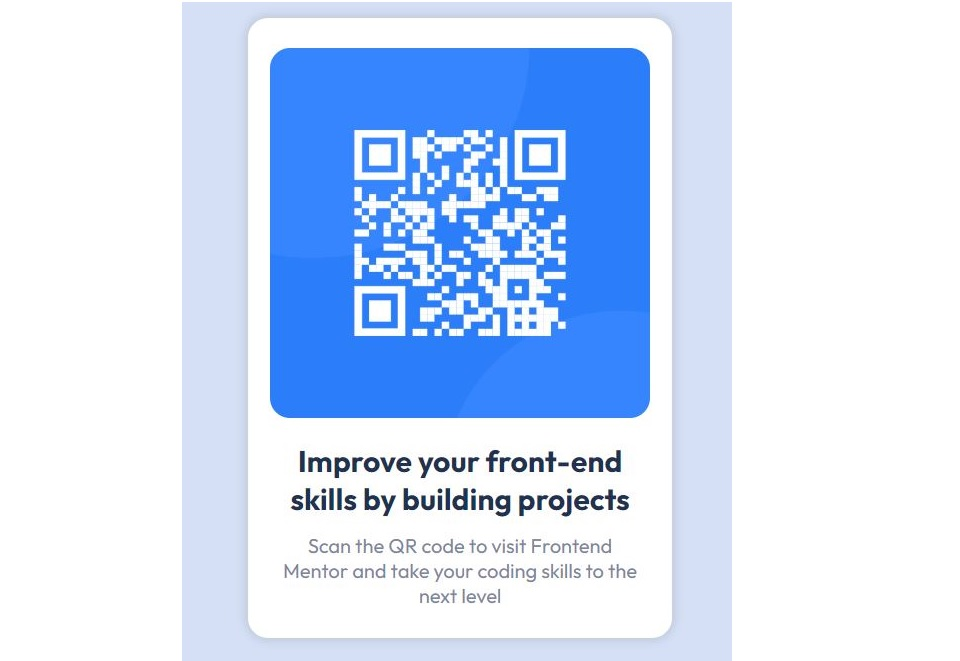

# Frontend Mentor - QR code component solution

This is a solution to the [QR code component challenge on Frontend Mentor](https://www.frontendmentor.io/challenges/qr-code-component-iux_sIO_H). Frontend Mentor challenges help you improve your coding skills by building realistic projects. 

## Table of contents

- [Overview](#overview)
  - [Screenshot](#screenshot)
  - [Links](#links)
- [My process](#my-process)
  - [Built with](#built-with)
  - [What I learned](#what-i-learned)
  - [Continued development](#continued-development)
  - [Useful resources](#useful-resources)
- [Author](#author)

## Overview
The goal of this coding assignment was to create a responsive web page that could adapt to different screen sizes. I used a combination of XHTML and CSS to achieve this goal.
XHTML was used to create the basic structure of the web page, addition of image, paragraphs. CSS was then used to style the web page and make it responsive.

### Screenshot

!

### Links

- Solution URL:(https://github.com/Nuelsti/QR-code-Design.git))
- Live URL: (https://qr-code-design-silk.vercel.app/)

## My process
I created the Html file and codes required, it was short because it only involved, insertion of image, and two paragraphs. 
First and furmost, I used an HTML element called <main> as the major element for other containers (
) to go in so i could style convienently and appropriately.
Aftwards, I kicked off the styling process, I used a mobile-first approach, meaning that I started by designing the web page for mobile devices and then scaled it up for larger screens. This approach helped to ensure that the web page was easy to use and view on any device.
The final step I took was casting the shadow on the main element. 

### Built with

- Semantic HTML5 markup
- CSS custom properties
- Mobile-first approach
- [Styled Components](https://fonts.googleapis.com) - For styles

### What I learned

I learned how to cast a shadow on an object. 

### Continued development

I want to continue to focus on how to make my webpages more responsive, and also build up my CSS skills more.

### Useful resources

- [Sider AI](https://sider.ai/invited?c=c5c22920ffecfad26a6134cd89ce61c4) - This showed me the code for casting shadow.

## Author

- Frontend Mentor - [@Nuelsti](https://www.frontendmentor.io/profile/Nuelsti)
- Twitter - [@Emmanue43756964](https://twitter.com/Emmanue43756964)

